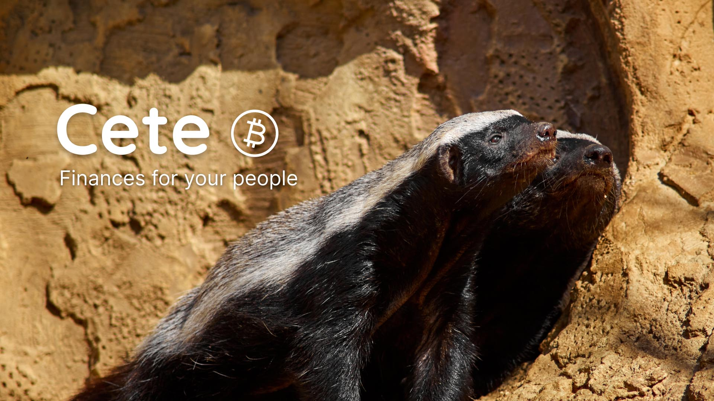
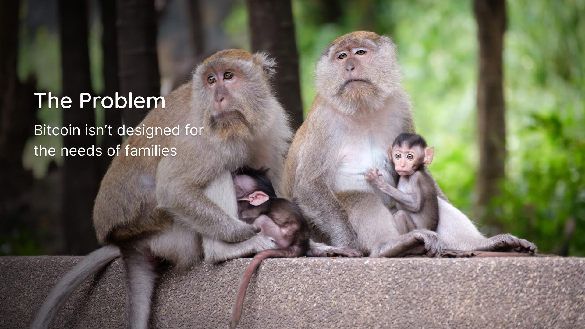
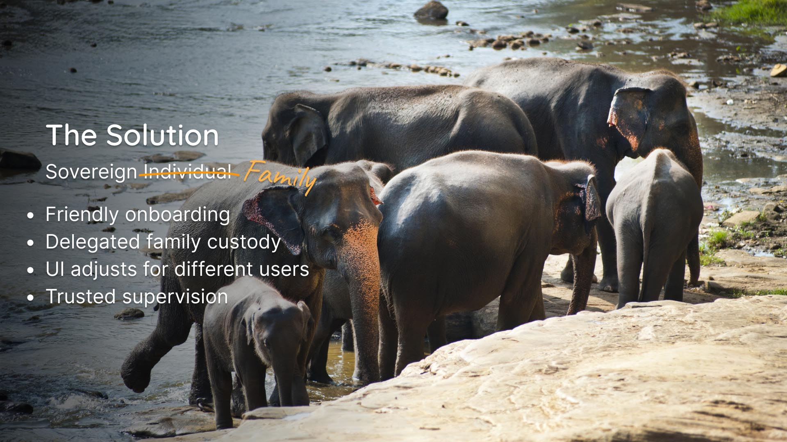
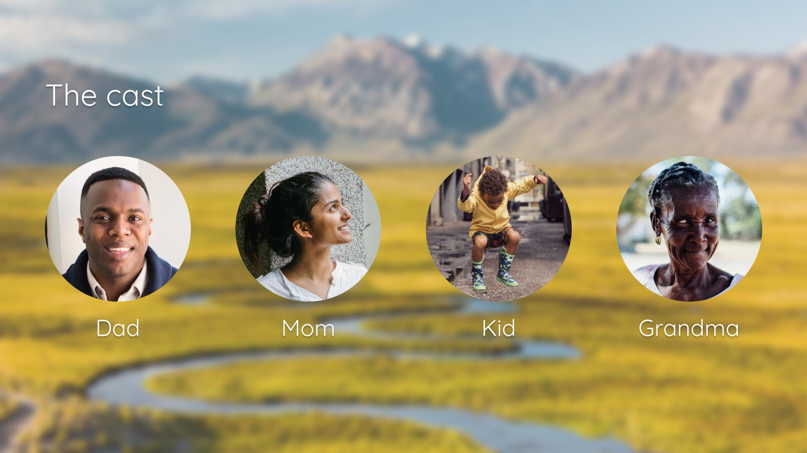
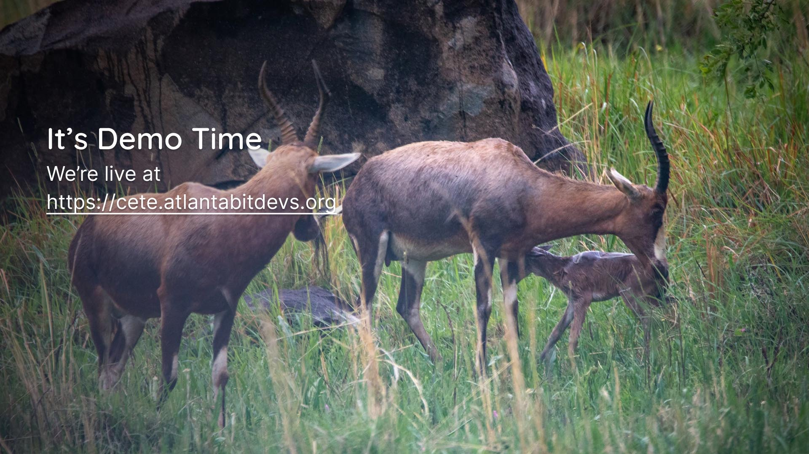
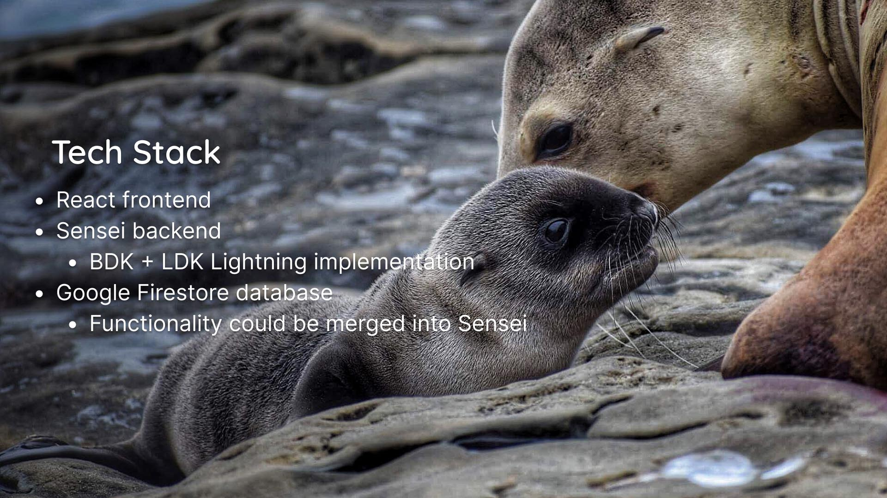
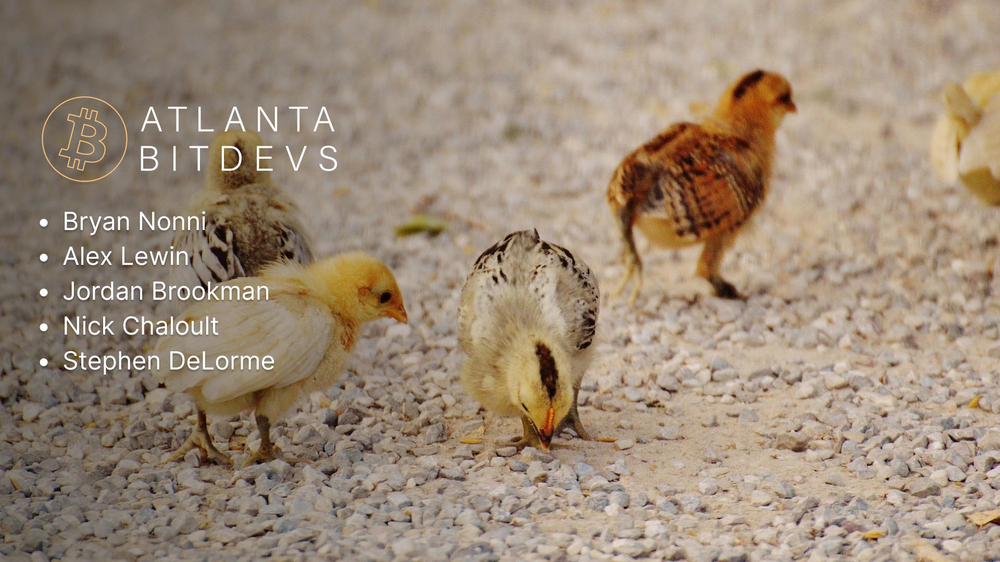

# Cete

Finances for your people

Cete is a software tool that helps families manage their finances on bitcoin.

This project is a submission to the 2022 [MIT Bitcoin Expo](https://www.mitbitcoinexpo.org/) Hackathon.

The frontend and backend code is separated into different directories. See README files in those directories for install instructions.

## Introduction

Animal families have interesting names:

- A litter of kittens
- A murder of crows
- A pod of whales
- A *cete* of honeybadgers

## The Problem

- At present, bitcoin can seem scary to learn.
- Not everyone is ready for self-custody immediately.
- The needs of a family may be more complex and nuanced than the needs of an individual.

## The Solution

There's plenty of talk about sovereign individuals. What about sovereign families?

We can accomplish this with friendly onboarding, delegated family custody, UI adjustments for different types of users, and trusted family supervision.

## User Journey

Imagine the following story:

- Dad is looking for a bitcoin-based, financial solution for his family.
- He downloads Cete and setups a vault for his family. He tests it out by sending it bitcoin.
- This is self-custodial -- Cete does not have access to Dad's private keys.
- Soon, he onboards his wife, and they are able to jointly manage their bitcoin finances.
- When they have their child, they setup an account for their child on their Cete instance
- As their kid grows, he can see his bitcoin from a watch-only wallet designed for kids.
- His parents are able to teach him about money and savings in a way that doesn't risk him losing his funds.
- As Grandma begins to get older, she needs assistance managing her finances. She moves her funds over to the Cete so Dad can help her.
- As years progress, Kid gets old enough to spend from hsi bitcoin wallet. Mom and Dad change the settings on the wallet to enable Kid to withdraw a weekly allowance from his account.
- Unfortunately, Grandma is unable to care for herself or her finances as she continues to age. Mom and Dad have Power of Attorney and are able to seamlessly assume full control of the funds within the Cete, but keep these delegated in a separate account for Grandma's care-taking.
- Once Kid nears adulthood, he is ready to assume full-control of his bitcoin.
- As Kid becomes an adult, Mom and Dad are able to export his bitcoin so he can form his own Cete.

See the rough demo online [here](https://cete.atlantabitdevs.org).

## Future Roadmap

- Add support for Validating Lightning Signer
- Add multi-sig controls. Mom, Dad, and Cete could participate in a 2-of-3 multi-sig, and Cete could automatically sign-off on some transactions that fall within certain spend limits.
- Add automatic LSP integration so that Mom and Dad never have to think about lightning liquidity.
- Build export functionality.

## Tech Stack

- React frontend
- [Sense](https://l2.technology/sensei) backend
- Google Firestore
  - Many functions relying on Firebase could potentially be merged into Sensei

## Our Team

## Thank You

